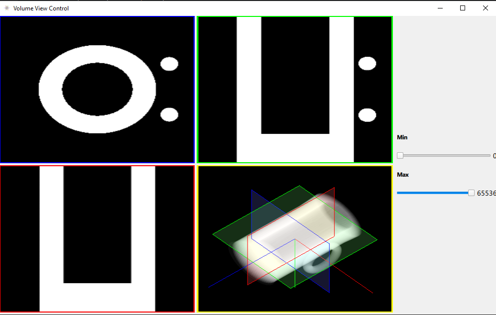
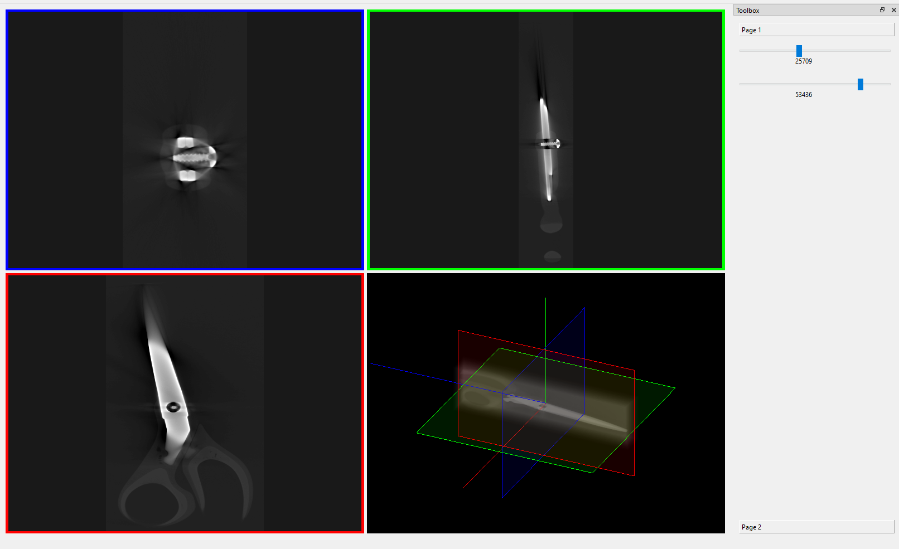
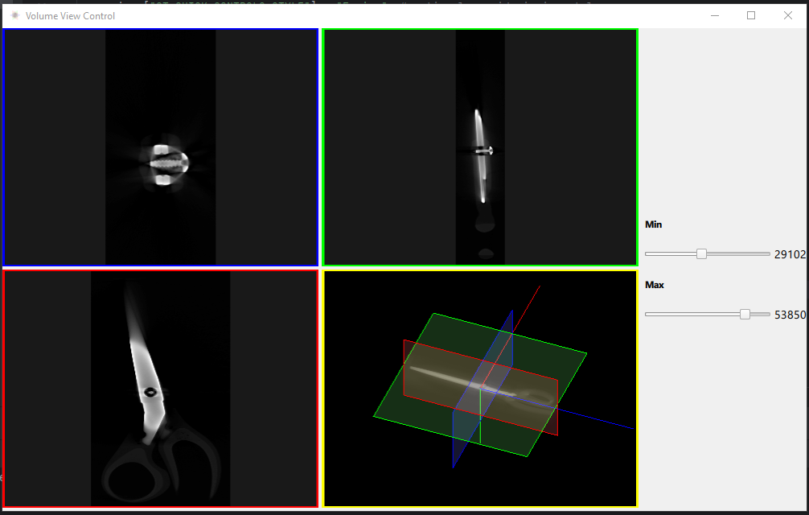

# CTLab
Simulation of CT acquisition process and volume reconstruction.  

- Points inside the model:


- First projection:

  

- Phantom visualization:

  

- Reconstruction using SimpleITK and viewed with napari


- Synthetic Volume rendered in quad view



- Real volume rendered in quad view (QWidgets)



- The quad views are implemented in C++ using Qt/OpenGL and loaded into QML via PySide6.




References:
I can't find where the wolf's 3d model came from.  

- Dependencies

    CUDA 12.8

    Qt 6.9.1

### Running on Linux (Ubuntu 24.04 / Wayland)
If the application crashes on startup with a `Segmentation fault` due to conflicts between Qt6 and OpenCV's GTK backend, force the application to use the X11 compatibility layer by running the following commands in your terminal before executing the binary:

```bash
export QT_QPA_PLATFORMTHEME=generic
export QT_QPA_PLATFORM=xcb
./bin/QuadWidgets
```

Alternatively, you can run it in a single line:
```bash
QT_QPA_PLATFORMTHEME=generic QT_QPA_PLATFORM=xcb ./bin/QuadWidgets
```


