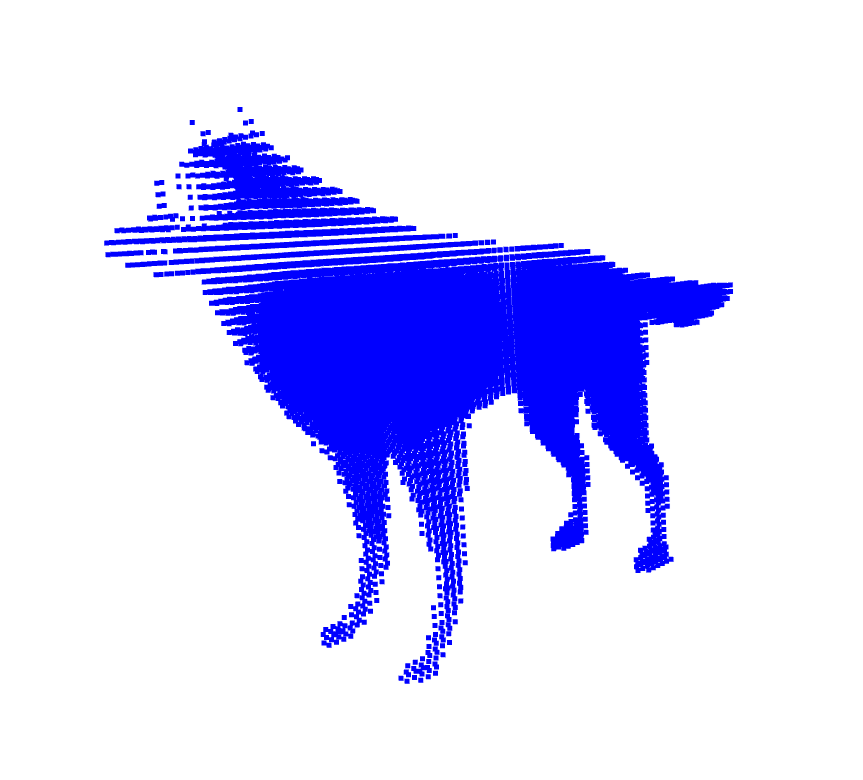

# CTLab
Simulation of CT acquisition process and volume reconstruction.  

- Reconstruction using SimpleITK and viewed with napari

- Points inside the model:

- Initial scanning configuration:

- First projection:

  

References:
I can't find where the 3d model came from.  

- Dependencies

    Python based reconstruction depends on SimpleITK

    pip install SimpleITK

    Python visualization depends on napari package

    pip install napari[all]

    CUDA 12.8

